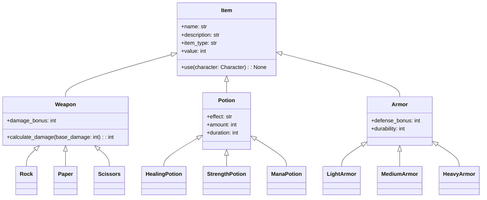
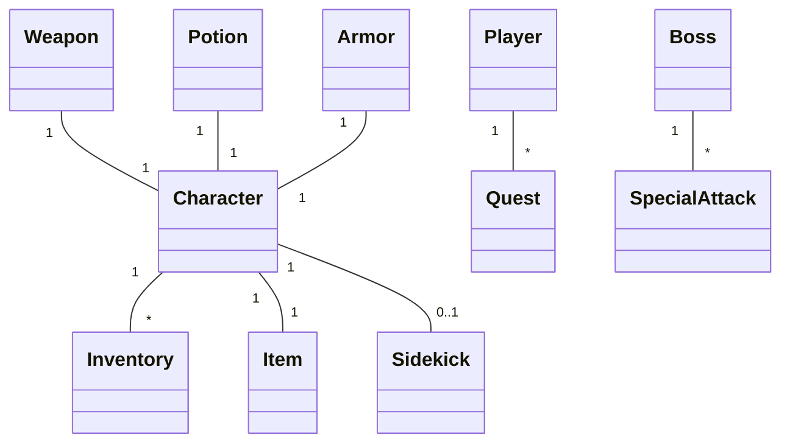

# RPG Game UML Diagram

```mermaid
classDiagram
    class Character {
        +name: str
        +health: int
        +max_health: int
        +damage: int
        +level: int
        +experience: int
        +inventory: Inventory
        +equipped_weapon: Item
        
        +attack(target: Character): int
        +take_damage(damage: int): int
        +heal(amount: int): None
        +level_up(): None
        +gain_experience(amount: int): None
        +add_item(item: Item): bool
        +use_item(item: Item): bool
        +equip_weapon(weapon: Item): bool
        +display(): None
    }

    class Player {
        +name: str
        +sidekick: Sidekick
        +quest_log: List[Quest]
        +inventory: Inventory
        
        +add_quest(quest: Quest): None
        +complete_quest(quest: Quest): None
        +get_active_quests(): List[Quest]
    }

    class Sidekick {
        +name: str
        +loyalty: int
        +special_ability: Callable
        
        +use_special_ability(): None
        +follow_player(): None
    }

    class Villain {
        +name: str
        +evil_level: int
        +dark_powers: List[str]
        +health: int
        +damage: int
        
        +attack(target: Character): int
        +use_dark_power(): None
    }

    class Boss {
        +name: str
        +boss_level: int
        +special_attacks: List[str]
        +health: int
        +damage: int
        
        +attack(target: Character): int
        +use_special_attack(): None
    }

    class Weapon {
        +name: str
        +description: str
        +damage_bonus: int
        +attack_type: str
        
        +use(character: Character): None
        +calculate_damage(base_damage: int): int
    }

    class Rock {
        +name: str
        +description: str
        +damage_bonus: int
        +attack_type: str
        
        +use(character: Character): None
        +shatter_shield(): bool
    }

    class Paper {
        +name: str
        +description: str
        +damage_bonus: int
        +attack_type: str
        
        +use(character: Character): None
        +wrap_enemy(): bool
    }

    class Scissors {
        +name: str
        +description: str
        +damage_bonus: int
        +attack_type: str
        
        +use(character: Character): None
        +pierce_armor(): bool
    }

    class Quest {
        +name: str
        +description: str
        +objectives: List[QuestObjective]
        +rewards: Dict[str, Any]
        +completed: bool
        
        +update_objective(index: int, amount: int): bool
        +get_progress(): str
        +complete(character: Character): None
    }

    class QuestObjective {
        +description: str
        +target: int
        +current: int
        +completed: bool
        
        +update_progress(amount: int): None
    }

    class Inventory {
        +max_slots: int
        +items: List[Item]
        +equipped_items: Dict[str, Item]
        
        +add_item(item: Item): bool
        +remove_item(item: Item): bool
        +use_item(item: Item): bool
        +equip_item(item: Item): bool
        +unequip_item(item_type: str): Item
    }

    class Config {
        +config_path: Path
        +config_data: Dict[str, Any]
        
        +load_config(): Dict[str, Any]
        +get_default_config(): Dict[str, Any]
        +save_config(): None
        +get(key: str): Any
        +set(key: str, value: Any): None
    }

    class SaveSystem {
        +save_dir: Path
        +current_save: Dict[str, Any]
        
        +save_game(game_state: Dict[str, Any]): bool
        +load_game(): Dict[str, Any]
        +get_save_slots(): Dict[int, Dict[str, Any]]
    }

    Character <|-- Player
    Character <|-- Sidekick
    Character <|-- Villain
    Villain <|-- Boss
    Weapon <|-- Rock
    Weapon <|-- Paper
    Weapon <|-- Scissors

    Sidekick <|-- DefenderSidekick
    Sidekick <|-- HealerSidekick
    Villain <|-- Goblin
    Villain <|-- Orc
    Boss <|-- FireBoss
    Boss <|-- IceBoss

    Item <|-- Weapon
    Item <|-- Potion
    Item <|-- Armor

    Potion <|-- HealingPotion
    Potion <|-- StrengthPotion
    Potion <|-- ManaPotion

    Armor <|-- LightArmor
    Armor <|-- MediumArmor
    Armor <|-- HeavyArmor

    Character "1" -- "*" Inventory
    Character "1" -- "1" Item
    Character "1" -- "0..1" Sidekick
    Player "1" -- "*" Quest
    Boss "1" -- "*" SpecialAttack
    Weapon "1" -- "1" Character
    Potion "1" -- "1" Character
    Armor "1" -- "1" Character
    Config "1" -- "0..1" SaveSystem
```

## Item Hierarchy

## Relationships

## Key Concepts

1. **Inheritance**
   - Character hierarchy shows clear inheritance relationships
   - Weapon types inherit from base Weapon class
   - Item types inherit from base Item class

2. **Polymorphism**
   - Different weapon types implement use() differently
   - Characters have different attack behaviors
   - Items have different effects

3. **Composition**
   - Characters have inventories
   - Players have sidekicks
   - Bosses have special attacks

4. **Aggregation**
   - Characters can have multiple items
   - Players can have multiple quests
   - Bosses can have multiple special attacks
